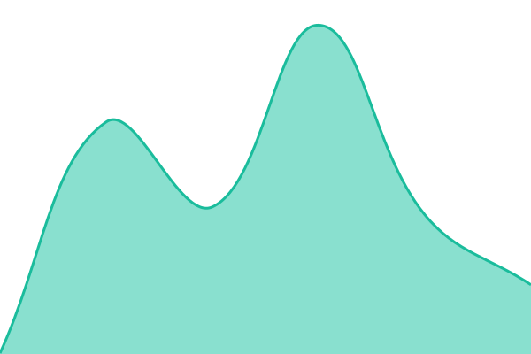

# [📈 Live Status](https://demo.upptime.js.org): <!--live status--> **🟩 All systems operational**

This repository contains the open-source uptime monitor and status page for [GLEMBIN](https://glembin.pl), powered by [Upptime](https://github.com/upptime/upptime).

With [Upptime](https://upptime.js.org), you can get your own unlimited and free uptime monitor and status page, powered entirely by a GitHub repository. We use [Issues](https://github.com/nglembin/status/issues) as incident reports, [Actions](https://github.com/nglembin/status/actions) as uptime monitors, and [Pages](https://demo.upptime.js.org) for the status page.

<!--start: status pages-->
<!-- This summary is generated by Upptime (https://github.com/upptime/upptime) -->
<!-- Do not edit this manually, your changes will be overwritten -->
<!-- prettier-ignore -->
| URL | Status | History | Response Time | Uptime |
| --- | ------ | ------- | ------------- | ------ |
|  [💼 glembin.pl / glembin.com](https://glembin.pl/) | 🟩 Up | [glembin-pl-glembin-com.yml](https://github.com/glembin/status/commits/HEAD/history/glembin-pl-glembin-com.yml) | 

 212ms
     
 | 

<a href="https://status.glembin.pl/history/glembin-pl-glembin-com">100.00%</a>
    

|  [🧠 Ekstrakorki.pl](https://dlakorepetytora.pl/) | 🟩 Up | [ekstrakorki-pl.yml](https://github.com/glembin/status/commits/HEAD/history/ekstrakorki-pl.yml) | 

 611ms
     
 | 

<a href="https://status.glembin.pl/history/ekstrakorki-pl">100.00%</a>
    

|  [💡 DlaKorepetytora.pl](https://ekstrakorki.pl/) | 🟩 Up | [dla-korepetytora-pl.yml](https://github.com/glembin/status/commits/HEAD/history/dla-korepetytora-pl.yml) | 

 221ms
     
 | 

<a href="https://status.glembin.pl/history/dla-korepetytora-pl">100.00%</a>
    

|  [🎓 Personal Tutoring Website](https://korki.nglembin.pl/) | 🟩 Up | [personal-tutoring-website.yml](https://github.com/glembin/status/commits/HEAD/history/personal-tutoring-website.yml) | 

 227ms
     
 | 

<a href="https://status.glembin.pl/history/personal-tutoring-website">100.00%</a>
    

|  [🏠 Personal Site](https://nglembin.pl/) | 🟩 Up | [personal-site.yml](https://github.com/glembin/status/commits/HEAD/history/personal-site.yml) | 

 228ms
     
 | 

<a href="https://status.glembin.pl/history/personal-site">100.00%</a>
    

|  [📈 Status Site](https://status.glembin.pl/) | 🟩 Up | [status-site.yml](https://github.com/glembin/status/commits/HEAD/history/status-site.yml) | 

 278ms
     
 | 

<a href="https://status.glembin.pl/history/status-site">100.00%</a>
    

<!--end: status pages-->

[**Visit our status website →**](https://demo.upptime.js.org)

## 📄 License

- Powered by: [Upptime](https://github.com/upptime/upptime)
- Code: [MIT](./LICENSE) © [Anand Chowdhary](https://anandchowdhary.com), supported by [Pabio](https://pabio.com)
- Data in the `./history` directory: [Open Database License](https://opendatacommons.org/licenses/odbl/1-0/)
