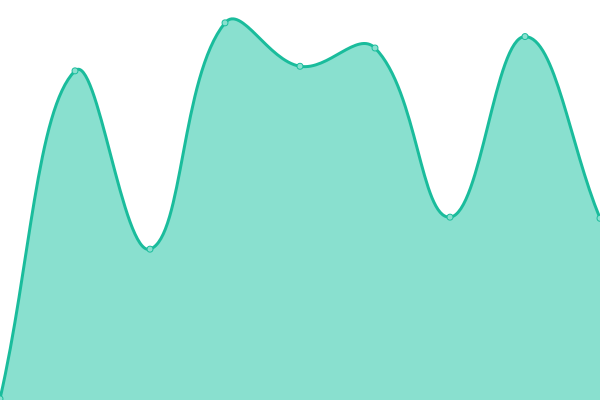

# [📈 Live Status](https://demo.upptime.js.org): <!--live status--> **🟩 All systems operational**

This repository contains the open-source uptime monitor and status page for [Nikodem (nyyn)](https://nglembin.pl), powered by [Upptime](https://github.com/upptime/upptime).

With [Upptime](https://upptime.js.org), you can get your own unlimited and free uptime monitor and status page, powered entirely by a GitHub repository. We use [Issues](https://github.com/nglembin/status/issues) as incident reports, [Actions](https://github.com/nglembin/status/actions) as uptime monitors, and [Pages](https://demo.upptime.js.org) for the status page.

<!--start: status pages-->
<!-- This summary is generated by Upptime (https://github.com/upptime/upptime) -->
<!-- Do not edit this manually, your changes will be overwritten -->
<!-- prettier-ignore -->
| URL | Status | History | Response Time | Uptime |
| --- | ------ | ------- | ------------- | ------ |
|  [💼 GLEMBIN™ Brand & Infrastructure](https://glembin.pl/) | 🟩 Up | [glembin-brand-and-infrastructure.yml](https://github.com/glembin/status/commits/HEAD/history/glembin-brand-and-infrastructure.yml) | 

 320ms
     
 | 

<a href="https://status.glembin.pl/history/glembin-brand-and-infrastructure">98.26%</a>
    

|  [📚 GLEMBIN™ Edu - Ekstrakorki.pl (Educational Portal)](https://ekstrakorki.pl/) | 🟩 Up | [glembin-edu-ekstrakorki-pl-educational-portal.yml](https://github.com/glembin/status/commits/HEAD/history/glembin-edu-ekstrakorki-pl-educational-portal.yml) | 

 272ms
     
 | 

<a href="https://status.glembin.pl/history/glembin-edu-ekstrakorki-pl-educational-portal">98.74%</a>
    

|  [📚 GLEMBIN™ Edu - Personal Education Platform](https://korki.nglembin.pl/) | 🟩 Up | [glembin-edu-personal-education-platform.yml](https://github.com/glembin/status/commits/HEAD/history/glembin-edu-personal-education-platform.yml) | 

 233ms
     
 | 

<a href="https://status.glembin.pl/history/glembin-edu-personal-education-platform">98.25%</a>
    

|  [🧩 Project under GLEMBIN™ - Responsive Web Development Service](https://strony.nglembin.pl/) | 🟩 Up | [project-under-glembin-responsive-web-development-service.yml](https://github.com/glembin/status/commits/HEAD/history/project-under-glembin-responsive-web-development-service.yml) | 

 2598ms
     
 | 

<a href="https://status.glembin.pl/history/project-under-glembin-responsive-web-development-service">100.00%</a>
    

|  [🧪 Personal Infrastructure & Testbed](https://nglembin.pl/) | 🟩 Up | [personal-infrastructure-and-testbed.yml](https://github.com/glembin/status/commits/HEAD/history/personal-infrastructure-and-testbed.yml) | 

 395ms
     
 | 

<a href="https://status.glembin.pl/history/personal-infrastructure-and-testbed">97.91%</a>
    

|  [📈 Status Site](https://status.glembin.pl/) | 🟩 Up | [status-site.yml](https://github.com/glembin/status/commits/HEAD/history/status-site.yml) | 

 352ms
     
 | 

<a href="https://status.glembin.pl/history/status-site">98.25%</a>
    

<!--end: status pages-->

[**Visit our status website →**](https://demo.upptime.js.org)

## 📄 License

- Powered by: [Upptime](https://github.com/upptime/upptime)
- Code: [MIT](./LICENSE) © [Anand Chowdhary](https://anandchowdhary.com), supported by [Pabio](https://pabio.com)
- Data in the `./history` directory: [Open Database License](https://opendatacommons.org/licenses/odbl/1-0/)
